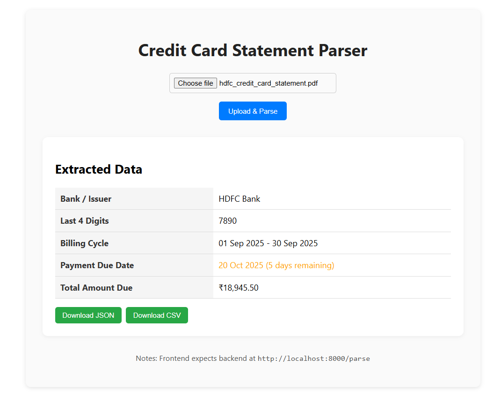

# Credit Card Statement Parser :-
A full-stack PDF parser that extracts key information from credit card statements for multiple banks, with OCR support for scanned PDFs. Built with FastAPI (backend) and React (frontend).

📄 Assignment Objective:
Build a PDF parser that extracts 5 key data points from credit card statements across 5 major credit card issuers.

## Features
Support for 5 banks: HDFC, SBI, ICICI, Axis, American Express.

Extracted data points:
Bank / Issuer Name
Last 4 Digits of Card
Billing Cycle
Payment Due Date
Total Amount Due
Handles real-world PDFs. Fast, responsive frontend demo for uploading PDFs and viewing extracted data.

## 🛠 Tech Stack
Backend:
Python 3.11+
FastAPI
Uvicorn (ASGI server)
pdfplumber (PDF text extraction)
pytesseract + pdf2image (OCR for scanned PDFs)
Pillow (image processing)

Frontend:
React
JavaScript


## 🏠 Home Page



## 📁 Project Structure
```
credit-card-parser/
│
├─ backend/
│  ├─ utils/
│  │  ├─ pdf_utils.py          # PDF extraction + OCR fallback
│  │  └─ detect_bank.py        # Detects bank from PDF text
│  ├─ parsers/
│  │  ├─ hdfc_parser.py
│  │  ├─ sbi_parser.py
│  │  └─ ...                   # Other bank parsers
│  ├─ main.py                  # FastAPI backend entry
│  └─ requirements.txt         # Python dependencies
│
├─ frontend/
│  ├─ src/
│  │  └─ App.jsx               # React frontend app
│  └─ package.json
│
├─ sample_pdf/
│  └─ hdfc_credit_card_statement.pdf  # Example HDFC PDF for testing/demo
│
└─ README.md
```


## ⚡Features

PDF Parsing
Extracts text using pdfplumber.
If PDF is scanned or text is minimal, automatically uses OCR (pytesseract + pdf2image).

Bank Detection
Detects bank from PDF content and selects corresponding parser.

Data Extraction
Parses and extracts 5 key data points for demo purposes.
Highlights Payment Due Date as per deadline.
Returns data in structured JSON.


## 🚀 How to Run
Backend:
cd backend

Create virtual environment
python -m venv venv
.\venv\Scripts\activate   # Windows

Install dependencies:
pip install -r requirements.txt

Start backend:
uvicorn main:app --reload
Backend will run at: http://localhost:8000

Frontend:
cd frontend
npm install
npm run dev
Frontend will run at: http://localhost:5173

Upload PDF and see results.